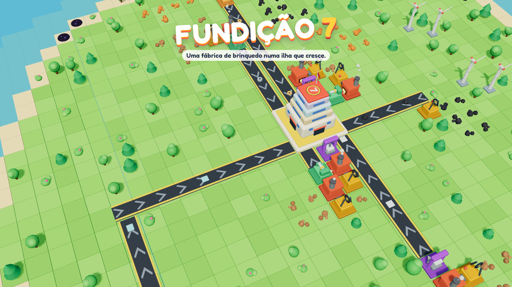

# Fundição 7



🎮 **[Jogar no navegador](https://japax01.com.br/game/)** (desktop e celular, instala como app)

Fábrica de brinquedo em 3D numa ilha que cresce. Você monta minas, esteiras e máquinas,
entrega itens na Sede para cumprir marcos e, a cada era, a ilha sobe do mar com terreno
e minérios novos. Seis eras, até lançar um foguete — depois, modo livre.

Depois do primeiro foguete o jogo continua:

- **Pedidos**: a partir da era 2, até 3 encomendas por vez (algumas relâmpago, com prazo) que pagam bem mais que a venda comum.
- **Foguetes repetidos**: cada 20 peças na plataforma montam outro foguete para lançar.
- **Engrenagens de Ouro e Legado**: foguetes, pedidos relâmpago e conquistas dão engrenagens, que compram bônus permanentes.
  **Nova ilha** recomeça do zero com esses bônus.
- **Conquistas** (22), **enfeites** (9, alguns só depois do foguete), cor do telhado da Sede e fogos de artifício.
- Velocidade 1×/2×/3×, ciclo de dia e noite (postes e janelas acendem), modo foto e tela de estatísticas.

Roda direto no navegador (desktop e celular) e instala como app (PWA), funcionando offline.

## Destaques técnicos

- **Simulação separada da tela**: `sim.js` não sabe nada de 3D, então as regras do jogo rodam e são testadas no Node (`npm test`, 22 testes)
- **Equilíbrio por dados**: todo o conteúdo (itens, receitas, eras, marcos) fica em `data.js`, e um script simula um jogador médio para medir o ritmo de cada era (`tests/pacing.mjs`)
- **Modelos 3D feitos por código** (three.js), sem arquivos de modelo
- **Áudio sintetizado** com WebAudio, sem arquivos de som
- **PWA**: instala e funciona offline; português e inglês
- Sem build e sem dependências em tempo de execução além do three.js

**Tecnologias:** JavaScript (ES modules) · three.js · WebAudio · PWA · Node test runner

## Como rodar

Sem build: é só servir a pasta.

```
python3 -m http.server 8000
# abra http://localhost:8000/
```

## Estrutura

| Arquivo | O que faz |
| --- | --- |
| `index.html` | Interface (HUD, barra de construção, janelas) e estilos |
| `src/data.js` | **Todo o conteúdo e equilíbrio**: itens, máquinas, receitas, eras, marcos, melhorias |
| `src/sim.js` | Simulação pura (sem tela): ilha, esteiras, máquinas, energia, marcos, dicas, save |
| `src/render.js` | Cena 3D (three.js): ilha, máquinas, itens, câmera, lançamento do foguete |
| `src/models.js` | Modelos 3D estilo brinquedo, feitos por código |
| `src/fx.js` | Partículas: fumaça, poeira, confete, fogos de artifício |
| `src/meta.js` | Progresso entre ilhas: engrenagens, legado, conquistas (salvo à parte da ilha) |
| `src/audio.js` | Sons e música sintetizados (sem arquivos de áudio) |
| `src/i18n.js` | Textos em português e inglês |
| `src/main.js` | Controles (mouse, teclado, toque), interface e salvamento |
| `vendor/` | three.js 0.170 (licença MIT em `vendor/THREE-LICENSE`) |
| `sw.js`, `manifest.webmanifest` | App instalável e offline |

## Testes

```
npm test                 # regras da simulação (node --test)
node tests/pacing.mjs    # estimativa do tempo de cada era
```

## Publicar

Copie a pasta inteira (menos `tests/`) para o servidor. Ao mudar arquivos, troque `VERSAO`
em `sw.js` para os jogadores receberem a versão nova. O jogo precisa ser aberto com a barra
no final (`/game/`); o `index.html` já corrige quem entra sem ela.
